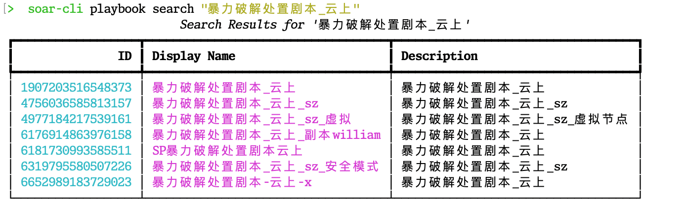
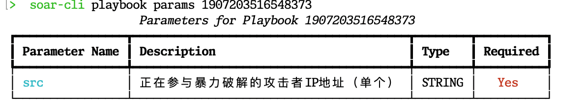
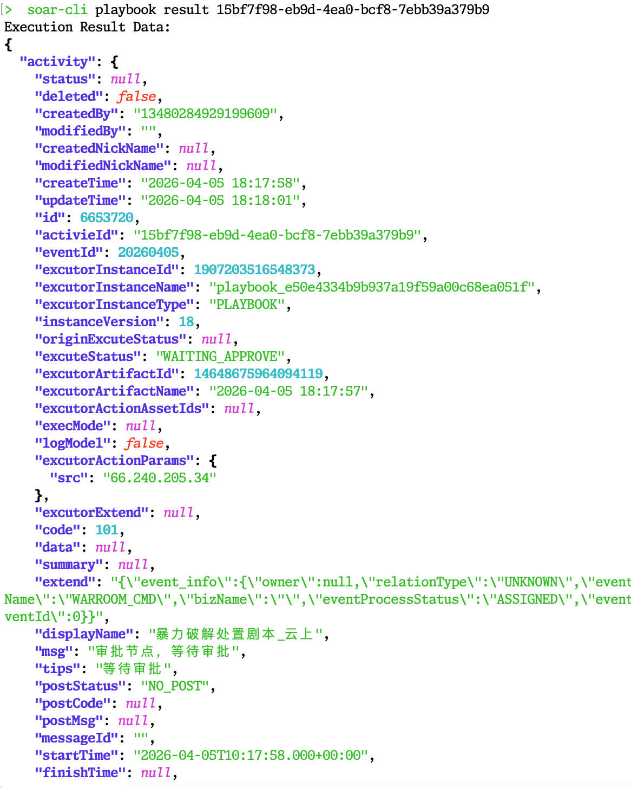

# Soar-CLI

[](https://opensource.org/licenses/MIT)

**soar-cli** 是一个专为人类操作和 AI Agent 自动化集成设计的轻量级命令行工具，旨在便捷地对接和调用编排自动化产品 OctoMation / HoneyGuide SOAR，执行安全剧本（Playbook）。

本开源项目由 **[上海雾帜智能科技有限公司 (flagify.com)](https://flagify.com/)** 提供技术支持。

### 兄弟项目系列
- **soar-cli** (本项目): [https://github.com/flagify-com/soar-cli](https://github.com/flagify-com/soar-cli)
- **soar-mcp**: [https://github.com/flagify-com/soar-mcp](https://github.com/flagify-com/soar-mcp)
- **OctoMation 核心引擎**: [https://github.com/flagify-com/OctoMation](https://github.com/flagify-com/OctoMation)

---

## 📦 安装与初始化

```bash
# 获取代码库
cd /opt/code/chris/SuperBody/dev/soar_cli

# (推荐) 创建并激活独立的虚拟环境
python3 -m venv venv
source venv/bin/activate

# 以可编辑模式进行本地安装
pip install -e .
```

## ⚙️ 配置文件配置
将源码包中的 `.env.example` 复制为 `.env` 并填入你的后端地址与认证 Token。

```bash
cp .env.example .env
```

## 👩‍💻 使用方法示例 (人类模式)
人类模式下，CLI 终端会自动渲染排列整齐的 ASCII 数据表，如果遇到缺失请求或 ID 不存在，会自动捕捉后台错误并给予明确的中文提示。

```bash
> soar-cli playbook search "暴力破解处置剧本_云上"
```



```bash
> soar-cli playbook params 1907203516548373
```



```bash
> soar-cli playbook execute 123 --params '{"src": "66.240.205.34"}'
Error: Execution failed: 请求参数错误 (400 Bad Request)。详细信息: 剧本不存在

> soar-cli playbook execute 1907203516548373 --params '{"src": "66.240.205.34"}'
Successfully started execution for Playbook 1907203516548373
Activity ID: 898e7d68-5389-4055-8e37-6124dd2c0a17
To check status: soar-cli playbook status 898e7d68-5389-4055-8e37-6124dd2c0a17

> soar-cli playbook status 15bf7f98-eb9d-4ea0-bcf8-7ebb39a379b9
Execution Status: WAITING_APPROVE
To see results: soar-cli playbook result 15bf7f98-eb9d-4ea0-bcf8-7ebb39a379b9

> soar-cli playbook result 15bf7f98-eb9d-4ea0-bcf8-7ebb39a379b9
```



## 🤖 使用方法 (Agent/大模型 严格 JSON 模式)
专为 LLMs / AutoGPT / 各种脚手架及调度任务定制。只需在全球任意命令前加上 `--json` (或 `-j`)。
所有终端富文本和交互输出会被立即屏蔽，仅输出严格的、可解析的 JSON 对象。

```bash
soar-cli --json playbook search "暴力破解处置剧本_云上"
soar-cli --json playbook params 1907203516548373
soar-cli --json playbook execute 1907203516548373 --params '{"src":"66.240.205.34"}'
soar-cli --json playbook status 15bf7f98-eb9d-4ea0-bcf8-7ebb39a379b9
soar-cli --json playbook result 15bf7f98-eb9d-4ea0-bcf8-7ebb39a379b9
```

部分结果示例：

```json
{
  "success": true,
  "data": {
    "playbookId": 1907203516548373,
    "params": [
      {
        "paramName": "src",
        "paramDesc": "正在参与暴力破解的攻击者IP地址（单个）",
        "paramType": "STRING",
        "required": true
      }
    ]
  }
}
```

---

## 📜 协议 (License)
本项目遵守 [MIT License](LICENSE) 开源协议，允许自由使用、修改及商用集成。由于它被设计为连接核心编排平台 OctoMation 的纯端侧脚手架，请放心分发与扩展！